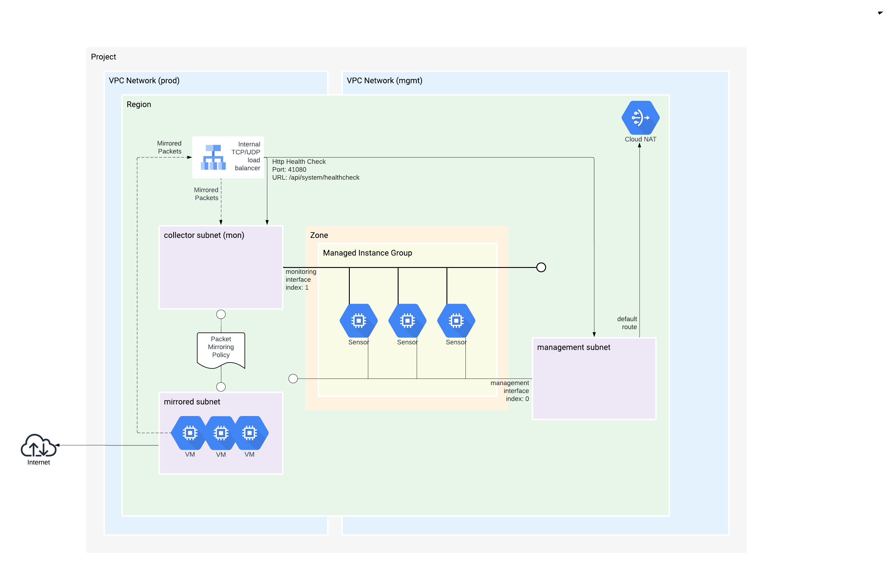

[#](#) terraform-gcp-sensor



Terraform for Corelight's GCP Cloud Sensor Deployment.

### Usage

```terraform
provider "google" {
  project        = "<the default project to manage resources in>"
  credentials    = "<path to or the contents of a service account key file>"
  region         = "<the default region to manage resources in>"
  zone           = "<the default zone to manage resources in>"
  default_labels = {
    terraform : true,
    example : true,
    purpose : "Corelight"
  }
}

module "sensor" {
  source = "github.com/corelight/terraform-gcp-sensor"
  
  project_id             = "<gcp project id>"
  region                  = "<instance region>"
  zone                    = "<instance availability zone>"
  network_mgmt_name       = "<virtual network management name>"
  subnetwork_mgmt_name    = "<virtual network subnetwork management name>"
  subnetwork_mgmt_cidr    = "<virtual network subnetwork management CIDR>"
  network_prod_name       = "<virtual network name for infra to be monitored"
  subnetwork_mon_name     = "<virtual network subnetwork monitoring name>"
  subnetwork_mon_cidr     = "<virtual network subnetwork monitoring CIDR>"
  subnetwork_mon_gateway  = "<virtual network subnetwork monitoring gateway>"
  instance_ssh_key_pub    = "<instance ssh public key>"
  image                   = "<instance image>"
  license_key             = "<your Corelight sensor license key>"
  community_string        = "<the community string (api string) often times referenced by Fleet>"
  
  fleet_token = "<the pairing token from the Fleet UI>"
  fleet_url   = "<the URL of the fleet instance from the Fleet UI>"
```

### Deployment

The variables for this module all have default values that can be overwritten
to meet your naming and compliance standards.

Deployment examples can be found [here][].

[here]: https://github.com/corelight/corelight-cloud/tree/main/terraform/gcp-mig-sensor

## License

The project is licensed under the [MIT][] license.

[MIT]: LICENSE
